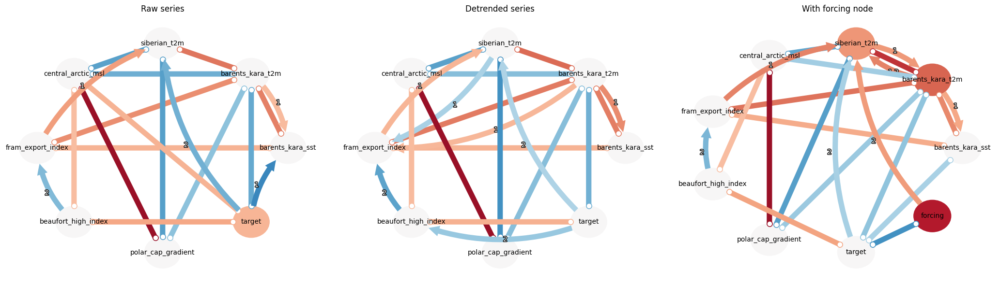
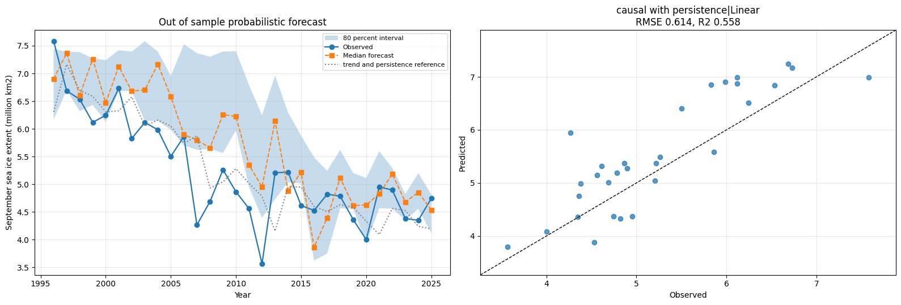

# Causal Informed Machine Learning for Seasonal Prediction of Arctic Sea Ice

Does winter atmospheric and oceanic state carry causal information about the following summer's
Arctic sea ice, beyond what secular trend and interannual persistence already provide?

The analysis estimates causal structure between November to April drivers and the September
minimum, uses that structure to select predictors for a set of statistical models, and tests
whether the resulting forecasts improve on naive references by a margin the satellite record can
actually support.

## Findings

**No model beat trend plus persistence.** The strongest naive reference reached RMSE 0.592. The
best learned model reached 0.614, which is 3.7 percent worse, with a bootstrap confidence interval
of [0.130, 0.177] and p = 0.708. The difference is not distinguishable from zero.

**Causal feature selection did beat using every predictor.** Three variables selected by causal
discovery outperformed all twenty five available predictors under the same estimator: delta RMSE
0.171, confidence interval [0.011, 0.320], p = 0.036. Every model built on the causal subset scored
between 0.614 and 0.685; every model built on the full set scored between 0.731 and 0.841.

**Conditioning on external forcing removed an apparent driver.** Central Arctic sea level pressure
appeared as a significant link in the raw series and disappeared once a forcing variable entered
the graph, which is the signature of shared secular trend rather than a seasonal mechanism.

**Most skill is persistence.** Shapley attribution assigned 70 percent of importance to the
previous year's ice, 20 percent to Barents and Kara Sea temperature, and 10 percent to the Beaufort
High index.

These results are consistent with the spring predictability barrier, which places an upper bound on
achievable skill for forecasts initialised before May.

## Figures



Causal structure estimated under three specifications: the raw series, the detrended series, and
the raw series with an explicit forcing node. Only links appearing in all three are carried into
the modelling stage.



Left: out of sample probabilistic forecast under expanding window cross validation, with the naive
reference shown for comparison. Right: observed against predicted for the best configuration.


Shapley decomposition of the fitted model. Attribution describes the fitted relationship and is not
an estimate of predictive skill.

## Method

**Data.** ERA5 monthly means north of 65 degrees supply eight fields: two metre temperature, sea
surface temperature, the two wind components, mean sea level pressure, downwelling longwave
radiation, net solar radiation, and sea ice concentration. The target is the NSIDC Sea Ice Index
(G02135). The record yields 46 complete winter seasons from 1979 onward.

**Predictors.** Fields are reduced to regional means over the Barents and Kara Seas, the Beaufort
Sea, the central Arctic, and the Siberian shelf, weighted by the cosine of latitude and computed
over ocean cells only. Regional wind means are discarded, because averaging a zonal wind across an
eighty degree band cancels opposing flows and destroys the variance. Three pressure gradient
indices replace them: a Fram Strait export proxy, a Beaufort High index, and a polar cap gradient
that serves as a proxy for the Arctic Oscillation.

**Seasonal alignment.** November and December are assigned to the following calendar year, so each
record pairs one complete winter with the September that follows it. Seasons missing any of the six
months are excluded.

**Causal discovery.** PCMCI with partial correlation, run under three specifications to separate
seasonal mechanism from shared trend. Augmented Dickey Fuller and KPSS tests establish that 17 of
25 series are nonstationary, which is why the trend treatment is necessary.

**Models.** Linear regression, ridge, random forest, and a small neural network, each fitted on the
raw target and on residuals from a trend fitted to the training window alone. The second framing
matters because tree ensembles cannot predict outside the range seen in training, so on a declining
series they are penalised for an inability to extrapolate rather than for predictor quality.

**Validation.** Expanding window cross validation throughout. All scaling and trend fitting occur
inside the training window and never see the test observation. Differences in skill are assessed by
paired bootstrap over fold level squared errors, because at roughly thirty test observations a gap
of a few hundredths lies within sampling variation.

**Intervals.** Split conformal prediction and linear quantile regression, both applied to trend
residuals, with empirical coverage reported against nominal rather than assumed.

## Running it

```bash
pip install cdsapi tigramite shap netcdf4 h5netcdf scikit-learn statsmodels xarray
export CDSAPI_KEY="your key"      # or set CDS_API_KEY in Kaggle Secrets
jupyter notebook arctic_sea_ice_causal_ml.ipynb
```

A Copernicus Climate Data Store account is required. Register at
https://cds.climate.copernicus.eu and accept the ERA5 licence before the first retrieval.

The ERA5 request returns roughly 350 MB and can queue for anywhere from minutes to hours depending
on load. The notebook checks for an existing file before retrieving, so reruns skip the download.
Everything else runs on CPU in a couple of minutes; no GPU is used or useful at this data size.


## Limitations and further work

**Sample size.** Roughly 45 annual observations constrain every stage. Conditional independence
testing has low power, confidence intervals on skill are wide, and competing models are often not
separable. Climate model ensembles are the standard route to larger samples, at the cost of a
transfer problem between simulated and observed conditions.

**Link orientation.** Every significant link returned unoriented, meaning PCMCI established
dependence but not direction. Because each row pairs one winter with the September that follows it,
direction can still be argued from temporal precedence, since only one ordering is physically
available. That argument rests on how the record is constructed rather than on the algorithm.

**Missing thickness.** Spring sea ice thickness and volume are the strongest documented precursors
of the September minimum and are absent here. ERA5 ice concentration is a partial substitute.
Adding PIOMAS or CryoSat 2 thickness is the change most likely to improve skill.

**Forcing proxy.** The smoothed Arctic mean temperature used as a forcing variable derives from the
same fields it is meant to condition. An observed global mean temperature series would be
independent of the predictors and preferable.

**Circulation indices.** The polar cap gradient approximates the Arctic Oscillation but is not that
index, which requires hemispheric coverage south of the retrieved domain. The Arctic Dipole, which
exerts strong control on ice export, is not represented.

**Temporal resolution.** Averaging November to April into one value discards the timing of moisture
intrusion events, where much of the physical mechanism resides. Monthly predictors with explicit
lags would let the lag structure of the causal method be used rather than collapsing to
contemporaneous relationships.

**Latent confounders.** PCMCI assumes causal sufficiency, that all common causes are observed.
LPCMCI relaxes this and would test the robustness of the estimated graph.

## References

### Data

Fetterer, F., Knowles, K., Meier, W. N., Savoie, M., Windnagel, A. K. and Stafford, T. (2025).
Sea Ice Index (G02135, Version 4) [Data Set]. Boulder, Colorado USA. National Snow and Ice Data
Center. https://doi.org/10.7265/a98x0f50

Hersbach, H., Bell, B., Berrisford, P., Hirahara, S., Horanyi, A., Munoz Sabater, J., Nicolas, J.,
Peubey, C., Radu, R., Schepers, D., Simmons, A., Soci, C., Abdalla, S., Abellan, X., Balsamo, G.,
Bechtold, P., Biavati, G., Bidlot, J., Bonavita, M., ... Thepaut, J. N. (2020). The ERA5 global
reanalysis. *Quarterly Journal of the Royal Meteorological Society*, 146(730), 1999 to 2049.
https://doi.org/10.1002/qj.3803

### Method

Runge, J., Nowack, P., Kretschmer, M., Flaxman, S. and Sejdinovic, D. (2019). Detecting and
quantifying causal associations in large nonlinear time series datasets. *Science Advances*,
5(11), eaau4996. https://doi.org/10.1126/sciadv.aau4996

Gerhardus, A. and Runge, J. (2020). High recall causal discovery for autocorrelated time series
with latent confounders. *Advances in Neural Information Processing Systems*, 33, 12615 to 12625.
LPCMCI, referenced in the caveats above.
